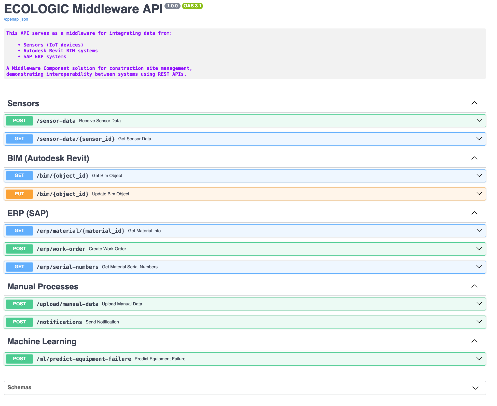

# ECOLOGIC Middleware PoC

This repository contains a FastAPI-based proof-of-concept for the ECOLOGIC Middleware Component, demonstrating how construction site systems, including IoT sensors, BIM, SAP ERP, manual processes, and machine learning, can be unified under a single REST interface. Includes a proxy to SAP S/4HANA Cloud’s [**Material Stock - Read**](https://api.sap.com/api/API_MATERIAL_STOCK_SRV/overview) OData service, showcasing potential for real integration.

## Setup

1. Clone and enter the project:

   ```bash
   git clone <repo_url>
   cd <local_path>
   ```
2. Create and activate a virtual environment:

   ```bash
   python3 -m venv .venv
   source .venv/bin/activate
   ```
3. Install dependencies:

   ```bash
   pip install -r requirements.txt
   ```
4. Copy `.env.example` to `.env` and set your SAP key:
  
   ```bash
   cp .env.example .env
   nano .env
   ```

## API Endpoints

### Sensors

* **POST /sensor-data**: Receive and store sensor readings.
* **GET  /sensor-data/{sensor\_id}**: Fetch latest sensor value and timestamp.

### BIM (Autodesk Revit)

* **GET  /bim/{object\_id}**: Return hard‑coded BIM object details.
* **PUT  /bim/{object\_id}**: Accept and confirm status updates.

### ERP Stubs

* **GET  /erp/material/{material\_id}**: Stubbed material info.
* **POST /erp/work-order**: Simulate work order creation.

### SAP Serial Numbers

* **GET  /erp/serial-numbers**: Proxies SAP S/4HANA Cloud’s `Material Stock - Read ` service. Returns parsed results for the end user.

This endpoint shows real-world SAP connectivity through OData and an API key.

### Manual Processes & ML

* **POST /upload/manual-data**: Upload CSV/Excel files.
* **POST /notifications**: Send email notifications (stub).
* **POST /ml/predict-equipment-failure**: Stubbed ML prediction based on sensor inputs.

## Running the Demo

Start the server:

```bash
python3 main.py
```

Swagger UI available at `http://localhost:8000/docs`



Run the demo script:

```bash
python3 demo.py
```
